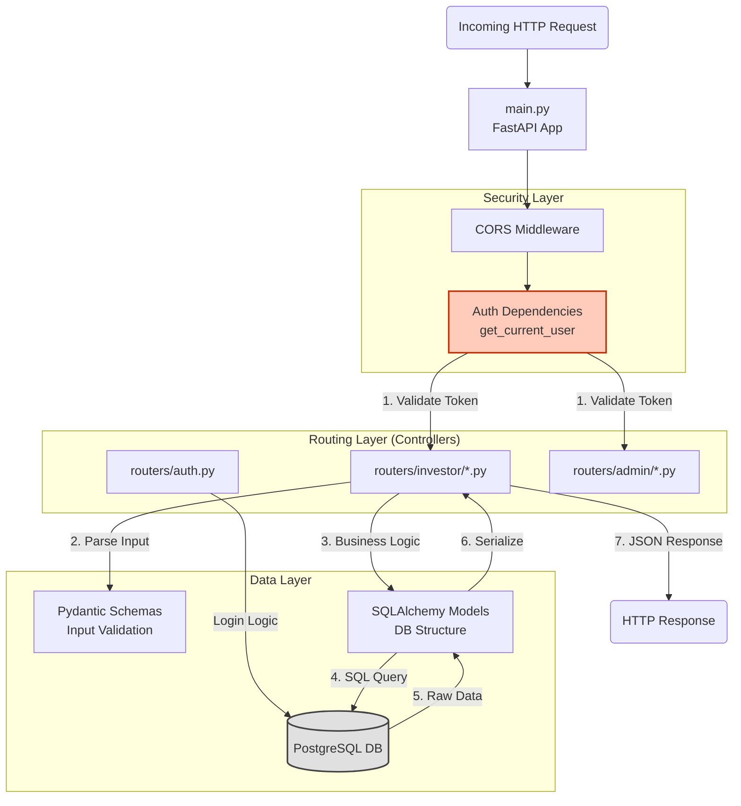
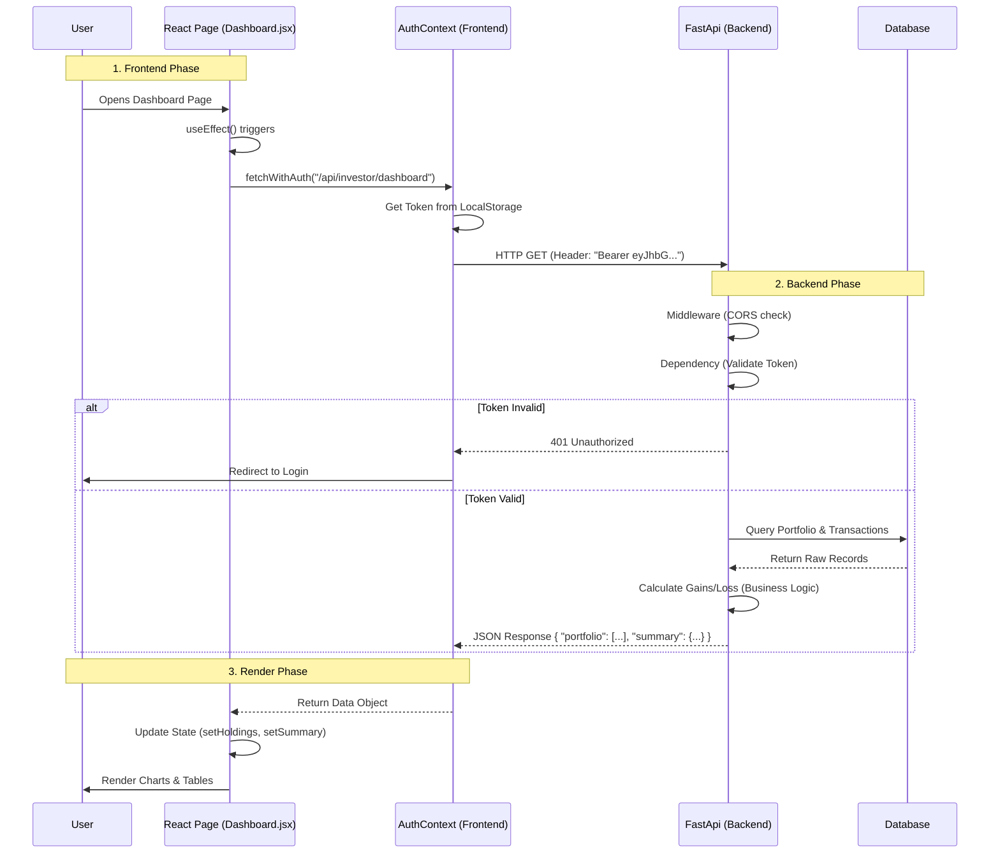

# 📊 RTA System Architecture & Logic Diagrams

This document contains "Mermaid" diagrams describing the logical flow of the Frontend and Backend, and how they interact.
*(Note: To view these diagrams graphically, use the Markdown Preview in VS Code or a Mermaid-compatible viewer).*

---

## 1. 🖥️ Frontend Architecture (Logic Flow)

The Frontend is a **State-Driven Single Page Application (SPA)**. The logic revolves centrally around the `AuthContext` which controls access and API communication.

```mermaid
graph TD
    %% Nodes
    Entry([main.jsx<br>Entry Point])
    App[App.jsx<br>Router Config]
    
    subgraph "Context Layer (Global State)"
        AuthCtx[AuthContext.jsx<br>Provider]
        State[(User State<br>& Token)]
        APIUtil[fetchWithAuth()<br>API Utility wrapper]
    end

    subgraph "Layout Layer"
        Layout[InvestorLayout.jsx]
        Sidebar[Sidebar Navigation]
        Header[Header & User Menu]
    end

    subgraph "Page Layer (Smart Components)"
        Login[Login.jsx]
        Dash[Dashboard.jsx]
        Inv[Investment Pages<br>Purchase/SIP]
        Svc[Service Pages<br>Complaints/Profile]
    end

    %% Flow Connections
    Entry --> App
    App --> AuthCtx
    AuthCtx -- "1. Init Check" --> State
    AuthCtx -- "2. Provide Context" --> Layout
    
    Layout --> Sidebar
    Layout --> Header
    Layout -- "Render Outlet" --> Dash
    Layout -- "Render Outlet" --> Inv
    Layout -- "Render Outlet" --> Svc

    %% Logic Logic
    Login -- "3. Login Action" --> AuthCtx
    AuthCtx -- "4. Set Token" --> State
    
    Dash -- "5. Data Request" --> APIUtil
    Inv -- "Data Request" --> APIUtil
    
    APIUtil -- "6. Attach Bearer Token" --> Req(Outgoing HTTP Request)
    
    style AuthCtx fill:#e1f5fe,stroke:#01579b,stroke-width:2px
    style APIUtil fill:#fff9c4,stroke:#fbc02d,stroke-width:2px
```

### 🧠 Frontend Logic Breakdown
1.  **Initialization**: App starts, `AuthContext` checks `localStorage`. If a token exists, the user is "Logged In".
2.  **Routing Guard**: `App.jsx` checks the `user` state. If null, it forces the user to `Login.jsx`.
3.  **Layout Composition**: If authenticated, `InvestorLayout` wraps the content, ensuring the Sidebar and Header are always present.
4.  **Secure Requests**: Pages (like Dashboard) typically load data on mount (`useEffect`). They **do not** call `fetch` directly. They call `fetchWithAuth` from the Context. This function intercepts the request, adds the `Authorization: Bearer <token>` header, and handles 401 (Unauthorized) errors globally.

---

## 2. ⚙️ Backend Architecture (Logic Flow)

The Backend is a **Service-Oriented FastAPI Application**. Logic is separated into Routers (Controllers), Schemas (Validation), and Models (Database).



### 🧠 Backend Logic Breakdown
1.  **Entry & Middleware**: The request hits `main.py`. CORS logic runs first to allow requests from the Frontend URL.
2.  **Dependency Injection (Security)**: Before executing the core logic of a protected route (e.g., Dashboard), FastAPI executes `get_current_user`. This function decodes the JWT token. If invalid, it throws a 401 Error immediately.
3.  **Router/Controller**: The specific function for the endpoint runs (e.g., `get_dashboard_data`).
4.  **ORM Interaction**: The code doesn't write raw SQL. It interacts with Python classes (Models). SQLAlchemy converts `db.query(Portfolio).filter(...)` into SQL.

---

## 3. � End-to-End Interlinking (The Complete Cycle)

This sequence diagram shows exactly how a user action on the frontend triggers the entire chain across the stack.

**Scenario: User views the Dashboard**


