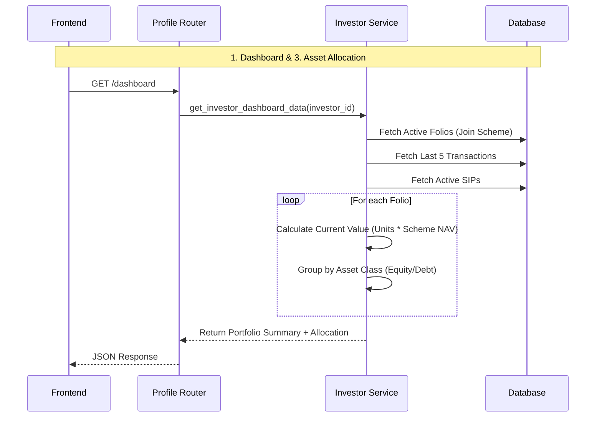
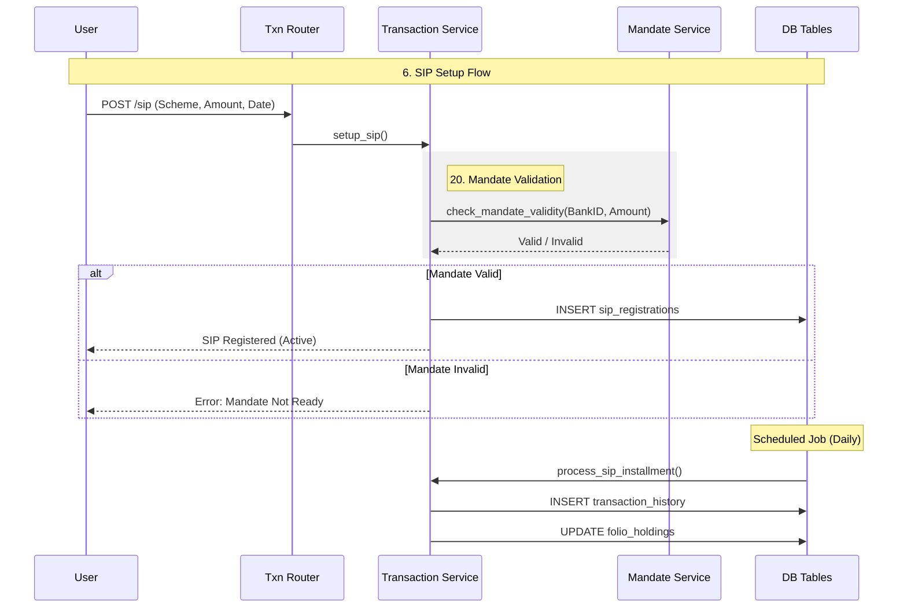
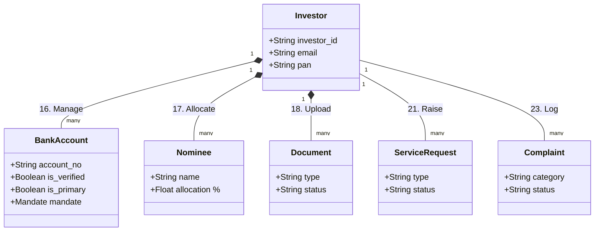
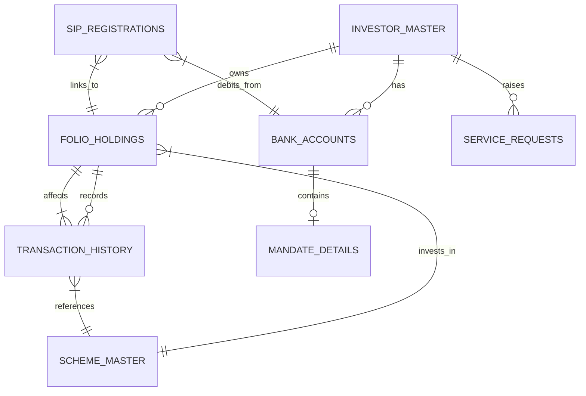

# Backend System Architecture & Workflow

This document provides a diagrammatic overview of the Investor Backend System, illustrating how various modules interact, flow, and store data.

## 1. High-Level System Architecture

This diagram shows the overall pattern used across the application: **Router -> Service -> Model -> Database**.

```mermaid
graph TD
    Client[Frontend Client] -->|HTTP Request| Auth[Auth Middleware (JWT)]
    Auth -->|Valid Token| Router[FastAPI Router]
    
    subgraph "Controller Layer"
        Router -->|Validate Schema| Pydantic[Pydantic Schemas]
    end
    
    subgraph "Service Layer (Business Logic)"
        Router -->|Call Service| Service[Service Class]
        Service -->|Calculations/Validations| Service
    end
    
    subgraph "Data Access Layer"
        Service -->|ORM Query| Model[SQLAlchemy Model]
        Model -->|SQL| DB[(PostgreSQL/SQL Database)]
    end
    
    Service -->|Return DTO| Router
    Router -->|JSON Response| Client
```

---

## 2. Detailed Data Flow by Module

### A. Dashboard & Portfolio (1, 3, 13, 15)

**Modules:** Dashboard, Asset Allocation, Valuation, Profile.



### B. Transaction Processing (2, 4, 5, 9, 10)

**Modules:** History, Purchase, Redemption, Switch, IDCW.

```mermaid
flowchart TD
    subgraph "4. Purchase (Lumpsum)"
        StartPurchase([User Initiates Purchase]) --> ValidateScheme{Is Scheme Open?}
        ValidateScheme -- Yes --> CheckFolio{Folio Exists?}
        CheckFolio -- No --> CreateFolio[Create New Folio]
        CheckFolio -- Yes --> UpdateFolio[Select Folio]
        CreateFolio --> CreateTxn[Insert Transaction (Type: Purchase)]
        UpdateFolio --> CreateTxn
        CreateTxn --> UpdateHoldings[Update Folio: Units += New Units]
        UpdateHoldings --> EndPurchase([Complete])
    end

    subgraph "5. Redemption"
        StartRedeem([User Initiates Redemption]) --> LockFolio[Lock Folio Row (DB)]
        LockFolio --> CalcExit[Calculate Exit Load]
        CalcExit --> CreateRedeemTxn[Insert Transaction (Type: Redemption)]
        CreateRedeemTxn --> ReduceHoldings[Update Folio: Units -= Redeemed Units]
        ReduceHoldings --> EndRedeem([Complete])
    end

    subgraph "9. Switch"
        StartSwitch([User Switches A -> B]) --> Atomic{Atomic Txn}
        Atomic --> RedeemA[Redeem from Scheme A]
        RedeemA --> BuyB[Purchase in Scheme B]
        BuyB --> LinkTxnW[Link Txn IDs]
        LinkTxnW --> EndSwitch([Complete])
    end
```

### C. Systematic Plans (6, 7, 8, 20)

**Modules:** SIP, SWP, STP, Mandates.



### D. Reports & Statements (12, 14, 11)

**Modules:** Capital Gains, CAS, Unclaimed.

```mermaid
graph LR
    subgraph "12. Capital Gains Logic"
        Input[Sell Transaction] --> FindBuy[Find Earliest Unmatched Buy (FIFO)]
        FindBuy --> Calc[Gap = Sell Date - Buy Date]
        Calc --> Classify{Gap > Threshold?}
        Classify -- "Yes (>1 Yr Equity)" --> LTCG[Long Term Gain]
        Classify -- "No" --> STCG[Short Term Gain]
    end

    subgraph "11. Unclaimed Amounts"
        BackOffice[Back Office Data] -->|Populate| UnclaimedTbl[Unclaimed Table]
        User[Investor] -->|Click Claim| API[Claim API]
        API -->|Update| Status[Status: Claimed]
        API -->|Init| BankTxn[Bank Transfer Process]
    end
```

### E. User Profile & Compliance (16-19, 21-25)

**Modules:** Banks, Nominees, Documents, Settings, Notifications, Complaints.



---

## 3. Database Schema Interlinking

This diagram highlights how the core tables connect to support the workflows above.



## 4. Module Workflows Summary

| Module | Primary Service | Data Source (Read) | Data Target (Write) |
| :--- | :--- | :--- | :--- |
| **Dashboard** | `InvestorService` | `folio`, `scheme`, `txn` | N/A (Read Only) |
| **History** | `TransactionService` | `transaction_history` | N/A |
| **Purchase** | `TransactionService` | `scheme_master` | `folio`, `transaction` |
| **Redemption** | `TransactionService` | `folio` (units check) | `folio` (deduct), `transaction` |
| **SIP/SWP/STP** | `TransactionService` | `bank_accounts` (mandate) | `sip_registrations`, `transaction` |
| **Reports** | `ReportService` | `transaction`, `folio` | N/A |
| **Profile** | `InvestorService` | `investor_master` | `investor_master`, `bank`, `nominee` |
| **Support** | `SupportService` | `support_tickets` | `support_tickets` |

